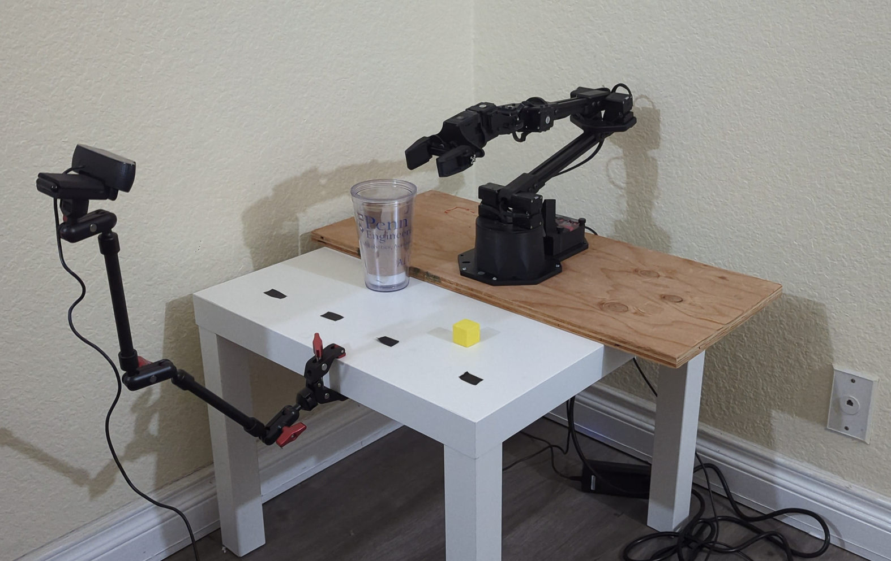

# WidowX 250S with LeRobot

This fork extends [LeRobot](https://github.com/huggingface/lerobot) to support the **WidowX 250S robotic arm** with **SpaceMouse teleoperation**.  

📌 For environment setup instructions, please refer to the original [LeRobot README](https://github.com/huggingface/lerobot/blob/main/README.md).  

🔗 Robot specifications can be found here: [WidowX 250S Documentation](https://docs.trossenrobotics.com/interbotix_xsarms_docs/specifications/wx250s.html)

📌 For detailed teleoperation setup and usage instructions, see the **Teleoperation System** section below.

---

## Experiments

### Pick and place the block into the cup using Action Chunking Transformer

#### 🟩 Attempt 1: Single-Camera Setup


Trained the [ACT](https://arxiv.org/abs/2304.13705) policy to perform a pick-and-place task — moving a block into a cup — using a **single front-mounted camera**.  

A total of **50 demonstration episodes** were collected using the **SpaceMouse teleoperation system**, with the block placed in various starting configurations.  
You can explore the dataset on Hugging Face: [widowx_250_pick_and_place_block](https://huggingface.co/datasets/msnaga/widowx_250_pick_and_place_block).  
##### 🎥 Episode Demo


The model was trained for **60,000 steps** using the default ACT hyperparameters.  
The corresponding trained checkpoint is available here: [widowx_250_pick_and_place_block_policy](https://huggingface.co/msnaga/widowx_250_pick_and_place_block_policy).

##### 📊 Observations
1. The model successfully learned the overall task but struggled with **precise positioning** of the gripper when reaching for the block or cup.  
2. The **single-camera setup** likely limited performance due to the **lack of depth information**.  
3. When the gripper approached the block from behind, it often **collided with the table**, as the 2D camera perspective made the alignment appear correct. Similarly, approaching from the front caused the gripper to **close too high** above the block.  
4. If the block was moved after the gripper had already reached it, the arm failed to adapt — this represents **out-of-distribution data** for the trained model.  
5. With some assistance (e.g., positioning the block more visibly in front), the arm was able to **grip and place** the block into the cup successfully.

##### ▶️ Policy Evaluation


#### 🟩 Attempt 2: Two-Cameras Setup
##### 🎥 Teleoperation using the SO 101 Leader Arm


For this attempt, the data collection process was streamlined by upgrading both the teleoperation hardware and the visual inputs:

* **Improved Teleoperation:** The **SO-101 leader arm** replaced the SpaceMouse for teleoperation. Controlling the system with a physical leader arm proved to be significantly easier and faster for collecting fluid demonstration data.
* **Kinematic Alignment:** The WidowX 250S features an additional forearm roll motor that is not present on the SO-101 leader arm. To resolve this hardware discrepancy during data collection, the WidowX's forearm roll motor was locked to its home position and excluded from active control. 
* **Dual-Camera Configuration:** To overcome the depth perception limitations observed in the single-camera setup, this configuration utilizes **two cameras** (one mounted overhead and one in the front). This provides the model with multiple perspectives to better estimate depth and spatial relationships in the workspace.

##### ▶️ Policy Evaluations


---

## Teleoperation System

You can teleoperate the WidowX 250S robotic arm using:
- **SO101 Leader Arm**
- **Keyboard controls**,
- **[3Dconnexion SpaceMouse](https://3dconnexion.com/dk/product/spacemouse-compact/)**  

The robot is controlled via **end-effector position control**.  

The **URDF model** for the WidowX 250S is taken from the [Interbotix ROS packages](https://github.com/Interbotix/interbotix_ros_manipulators/blob/main/interbotix_ros_xsarms/interbotix_xsarm_descriptions/urdf/wx250s.urdf.xacro).

---

### SpaceMouse Setup

#### Install Dependencies
```bash
sudo apt-get update
sudo apt-get install libhidapi-hidraw0 libhidapi-libusb0
mamba install -c conda-forge hidapi
pip install pyspacemouse easyhid
```
#### Set Up UDEV Rules
1. Identify the device using
    ```bash
    lsusb
    ```
    Example output:
    ```
    Bus 001 Device 005: ID 256f:c62e 3Dconnexion SpaceMouse Compact
    ```
2. Replace `idVendor` and `idProduct` values in the command below if they differ from your device:
    ```bash
    sudo sh -c 'echo "KERNEL==\"hidraw*\", ATTRS{idVendor}==\"256f\", ATTRS{idProduct}==\"c635\", MODE=\"0666\"" > /etc/udev/rules.d/99-spacemouse.rules'
    sudo udevadm control --reload-rules && sudo udevadm trigger
    ```
3. Replug the SpaceMouse for changes to take effect.

### Enable Low Latency Mode for USB (Robot Arm)
1. Identify the FTDI/USB2Dynamixel adapter using:
    ```bash
    lsusb
    ```
    Example output:
    ```
    Bus 001 Device 038: ID 0403:6014 Future Technology Devices International, Ltd FT232H Single HS USB-UART/FIFO IC
    ```
2. Replace `idVendor` and `idProduct` values in the command below if they differ from your device:
   ```bash
   sudo sh -c 'echo "ACTION==\"add\", SUBSYSTEM==\"tty\", ATTRS{idVendor}==\"0403\", ATTRS{idProduct}==\"6014\", RUN+=\"/bin/setserial /dev/%k low_latency\"" > /etc/udev/rules.d/99-dynamixel.rules'
   sudo udevadm control --reload-rules && sudo udevadm trigger
   ```
3. Replug the robot arm for changes to take effect.

### Running the Teleoperation Script
Example command to run the teleoperation script with SpaceMouse
```bash
python teleoperate.py --robot.type=widowx_250s_end_effector --robot.id 1 --robot.port=/dev/ttyUSB0 --robot.cameras={ top: {type: opencv, index_or_path: /dev/video4, width: 640, height: 480, fps: 30}} --teleop.type=space_mouse --display_data=true 

```
For keyboard teleoperation use `teleop.type=keyboard_ee`.

For smooth space mouse control, some keyboard hotkeys are available:
- 'r': Toggles rotation lock so that only translation is applied
- 't': Toggles translation lock so that only rotation is applied
- 'g': Toggles gripper open/close